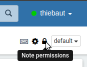
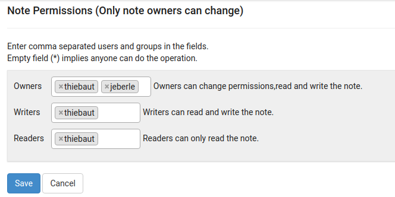
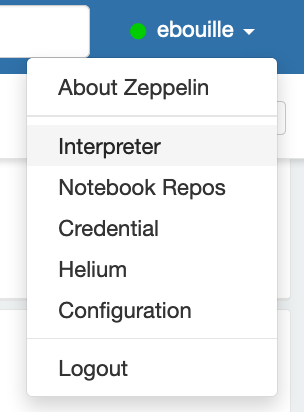
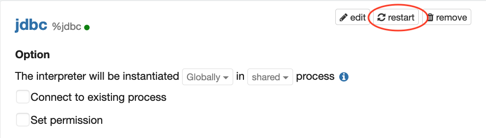

# Homework 2

The instructions to setup your copy of the project can be found on the course
web site: https://dslab2019.github.io/labs/week6/.

## Import the notebook in Zeppelin

1. Download the notebook from the following url [`https://git-dslab.epfl.ch/dslab2019/homework2/raw/master/Assignment_DataScience_Lab_week6_2019_Questions.json?inline=false`](https://git-dslab.epfl.ch/dslab2019/homework2/raw/master/Assignment_DataScience_Lab_week6_2019_Questions.json?inline=false)
2. Go to <https://iccluster042.iccluster.epfl.ch:9995/> and login (top-right).
3. Click on `Import note`, and load the notebook with `Select JSON file`.
4. Open the notebook to find all the questions for this assignment.

Edit the notebook to complete the assignment.
There are 2 sections totalling to 60 points.

## Committing work

On your notebook, click the 'Export notebook' button and save the json file to your
repository. Then commit your work.

You will have to import it again if a different version was committed by one of your
team mates.

While the process can look a bit tedious, we recommend to commit and push regularly your changes to gitlab.

The content of your repository at the time of the deadline will be used for
grading your work.
In other words, if you push changes past the deadline, these will NOT be
taken into account.

## Sharing the Zeppelin notebook

You can make it so that you can concurrently view/edit the notebook.

First, on the top-right, click on 'Note permissions'

Then add your team mates by typing their gaspar names:

## Hints

If you get the error `org.apache.hive.service.cli.HiveSQLException: Invalid SessionHandle: SessionHandle [...]`. Try to restart your JDBC interpreter.

First, on the top-right, click on the drop-down menu under your login name, and select _interpreter_.

Then find the panel of the  _jdbc_  interpreter and restart.

